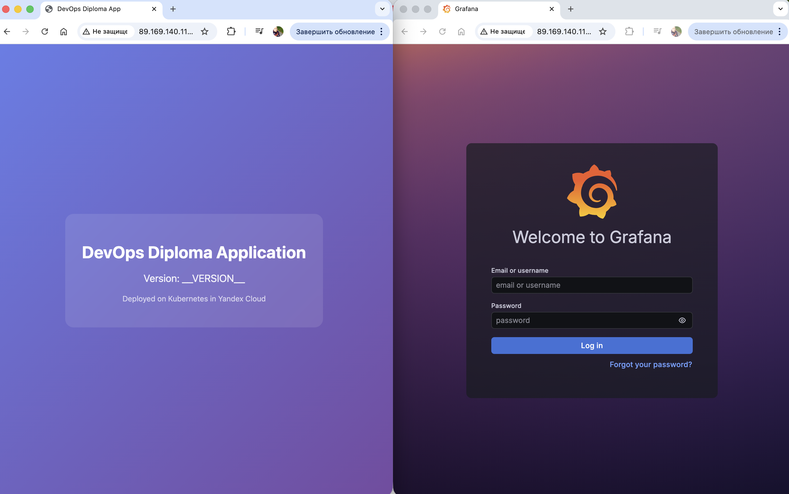
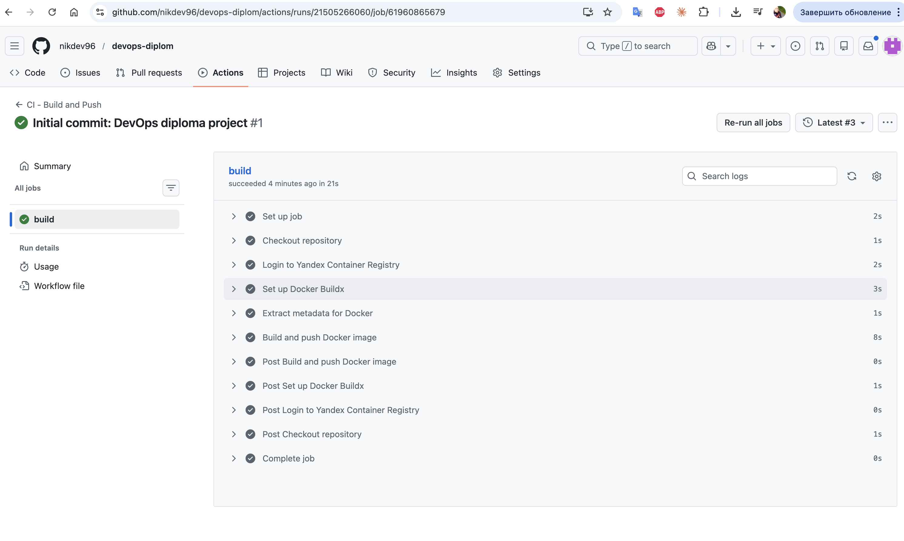

# Дипломная работа по курсу «DevOps-инженер»

## Описание проекта

Данный проект представляет собой полноценную облачную инфраструктуру, развёрнутую в Yandex Cloud. В рамках работы реализованы:

- Автоматическое создание инфраструктуры с помощью Terraform
- Kubernetes кластер, развёрнутый через Kubespray
- Система мониторинга на базе Prometheus и Grafana
- CI/CD пайплайн с автоматической сборкой и деплоем приложения

---

## Инфраструктура

### Облачные ресурсы

Вся инфраструктура разворачивается в Yandex Cloud и включает:

| Ресурс | Описание |
|--------|----------|
| **VPC** | Виртуальная сеть с тремя подсетями в разных зонах доступности |
| **Compute** | 3 виртуальные машины (1 master + 2 worker) на Ubuntu 22.04 |
| **Container Registry** | Приватный реестр для хранения Docker-образов |
| **Object Storage** | S3-бакет для хранения состояния Terraform |

### Схема сети

```
+---------------------------------------------------------------+
|                        VPC: diploma-vpc                       |
|                                                               |
|  +----------------+  +----------------+  +----------------+   |
|  | ru-central1-a  |  | ru-central1-b  |  | ru-central1-d  |   |
|  | 10.10.1.0/24   |  | 10.10.2.0/24   |  | 10.10.3.0/24   |   |
|  |                |  |                |  |                |   |
|  |    master      |  |   worker-1     |  |   worker-2     |   |
|  +----------------+  +----------------+  +----------------+   |
+---------------------------------------------------------------+
```

---

## Kubernetes кластер

Кластер развёрнут с использованием Kubespray и состоит из:

- **1 Master-нода** — управляющий узел с control plane компонентами
- **2 Worker-ноды** — рабочие узлы для запуска приложений

### Характеристики нод

| Параметр | Значение |
|----------|----------|
| ОС | Ubuntu 22.04 LTS |
| CPU | 2 vCPU |
| RAM | 4 GB |
| Диск | 50 GB SSD |
| Тип | Прерываемые (preemptible) |

### Установленные компоненты

- Kubernetes v1.28.6
- Calico (сетевой плагин)
- CoreDNS
- Metrics Server

---

## Мониторинг

Система мониторинга развёрнута с использованием Helm-чарта `kube-prometheus-stack` и включает:

| Компонент | Назначение |
|-----------|------------|
| **Prometheus** | Сбор и хранение метрик (retention: 7 дней) |
| **Grafana** | Визуализация метрик и дашборды |
| **Alertmanager** | Управление алертами |
| **Node Exporter** | Сбор метрик с узлов кластера |
| **Kube State Metrics** | Метрики объектов Kubernetes |

### Скриншот Grafana и приложения



---

## Тестовое приложение

Простое веб-приложение на базе Nginx, отображающее информацию о деплое.

### Особенности

- Базовый образ: `nginx:1.25-alpine`
- Встроенный health check (`/health`)
- 2 реплики для отказоустойчивости

---

## CI/CD

Реализовано два GitHub Actions workflow:

### Скриншот CI/CD pipeline



### CI — Сборка образа

**Триггер:** Push в ветку `main`

Этапы:
1. Checkout кода
2. Авторизация в Yandex Container Registry
3. Сборка Docker-образа
4. Push образа с тегами `latest` и `<commit-sha>`

### CD — Деплой в кластер

**Триггер:** Создание тега вида `v*` (например, `v1.0.0`)

Этапы:
1. Сборка образа с версионным тегом
2. Push в Container Registry
3. Обновление Deployment в Kubernetes
4. Ожидание успешного rollout

---

## Структура репозитория

```
.
├── terraform/
│   ├── 00-sa-bucket/        # Сервисный аккаунт и S3 для state
│   ├── 01-network/          # VPC и подсети
│   ├── 02-compute/          # Виртуальные машины
│   └── 03-registry/         # Container Registry
│
├── ansible/
│   ├── inventory/           # Inventory для Kubespray
│   └── generate-inventory.sh
│
├── kubernetes/
│   ├── app/                 # Манифесты приложения
│   ├── monitoring/          # Конфигурация Prometheus/Grafana
│   └── atlantis/            # Atlantis для Terraform
│
├── app/
│   ├── Dockerfile
│   ├── nginx.conf
│   └── static/
│
├── scripts/
│   ├── setup-kubespray.sh
│   ├── deploy-monitoring.sh
│   └── deploy-app.sh
│
├── .github/workflows/
│   ├── ci.yml               # Сборка образа
│   └── cd.yml               # Деплой в кластер
│
└── img/                     # Скриншоты для документации
```

---

## Доступ к сервисам

| Сервис | URL | Порт |
|--------|-----|------|
| **Приложение** | http://89.169.140.116:30000 | NodePort 30000 |
| **Grafana** | http://89.169.140.116:30080 | NodePort 30080 |

### Учётные данные Grafana

- **Логин:** admin
- **Пароль:** securePassword123

---

## Инструкция по развёртыванию

### Предварительные требования

- Yandex Cloud CLI (`yc`)
- Terraform >= 1.0
- kubectl
- Helm
- Ansible

### Шаг 1. Настройка Yandex Cloud

```bash
# Инициализация yc CLI
yc init

# Экспорт переменных окружения
export YC_TOKEN=$(yc iam create-token)
export YC_CLOUD_ID=$(yc config get cloud-id)
export YC_FOLDER_ID=$(yc config get folder-id)
```

### Шаг 2. Создание backend для Terraform

```bash
cd terraform/00-sa-bucket
terraform init && terraform apply
```

### Шаг 3. Создание сетевой инфраструктуры

```bash
cd terraform/01-network
terraform init && terraform apply
```

### Шаг 4. Создание виртуальных машин

```bash
cd terraform/02-compute
terraform init && terraform apply
```

### Шаг 5. Создание Container Registry

```bash
cd terraform/03-registry
terraform init && terraform apply
```

### Шаг 6. Развёртывание Kubernetes

```bash
./scripts/setup-kubespray.sh
./ansible/generate-inventory.sh

cd kubespray
ansible-playbook -i inventory/diploma-cluster/hosts.yaml \
  --become --become-user=root \
  -u ubuntu cluster.yml
```

### Шаг 7. Настройка kubectl

```bash
scp ubuntu@<master_ip>:/etc/kubernetes/admin.conf ~/.kube/config
kubectl get nodes
```

### Шаг 8. Деплой мониторинга и приложения

```bash
./scripts/deploy-monitoring.sh
./scripts/deploy-app.sh
```

---

## GitHub Secrets

Для работы CI/CD необходимо добавить следующие секреты:

| Секрет | Описание |
|--------|----------|
| `YC_REGISTRY_ID` | ID Container Registry в Yandex Cloud |
| `YC_SA_JSON_CREDENTIALS` | JSON-ключ сервисного аккаунта |
| `KUBE_CONFIG` | Base64-encoded kubeconfig |

---

## Проверка работоспособности

```bash
# Статус нод кластера
kubectl get nodes

# Все поды в кластере
kubectl get pods --all-namespaces

# Проверка приложения
curl http://89.169.140.116:30000

# Проверка Grafana
curl http://89.169.140.116:30080
```

---

## Автор

**Никита Селиверстов**

Выполнено в рамках дипломной работы по курсу «DevOps-инженер» (Нетология)

---

## Возникшие проблемы и их решения

### 1. Ошибка «Registry not found» при сборке Docker-образа

**Проблема:** CI pipeline падал с ошибкой `failed to push: unknown: Registry *** not found`

**Причина:** В GitHub Secrets был указан неверный `YC_REGISTRY_ID` от несуществующего реестра.

**Решение:** Получили актуальный ID реестра командой `yc container registry list` и обновили секрет в настройках репозитория.

---

### 2. Недоступность нод кластера по SSH

**Проблема:** Kubespray не мог подключиться к виртуальным машинам.

**Причина:** Отсутствовал NAT на сетевых интерфейсах ВМ, из-за чего машины не имели доступа в интернет и внешних IP-адресов.

**Решение:** В Terraform-конфигурации добавлен параметр `nat = true` для сетевых интерфейсов всех нод.

---

### 3. Ошибки при установке Kubespray

**Проблема:** Ansible падал из-за несовместимости версий Python-зависимостей.

**Причина:** Локальное окружение Python конфликтовало с требованиями Kubespray.

**Решение:** Создан отдельный Python virtual environment и установлены зависимости из `requirements.txt` Kubespray.

---

### 4. Pods не могли pull'ить образы из Container Registry

**Проблема:** Поды приложения оставались в статусе `ImagePullBackOff`.

**Причина:** У нод кластера не было прав на чтение образов из приватного реестра.

**Решение:**
- Создан сервисный аккаунт с ролью `container-registry.images.puller`
- Добавлен Kubernetes Secret типа `docker-registry` с credentials
- В Deployment указан `imagePullSecrets`
